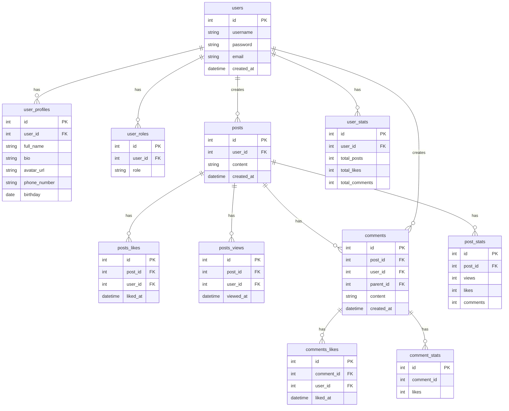

User service: `users`, `user_profiles`, `user_roles`

Posts service: `posts`, `posts_likes`, `posts_views`, `comments`, `comments_likes`

Statistics service: `post_stats`, `comments_stats`, `user_stats`

